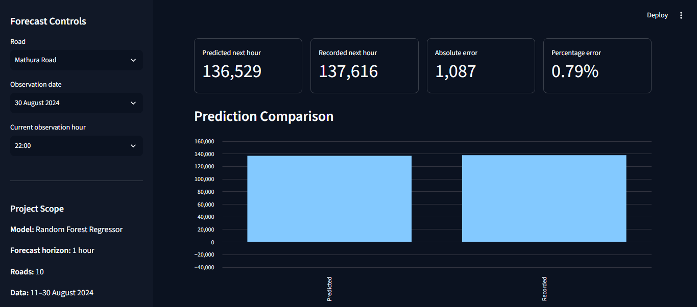
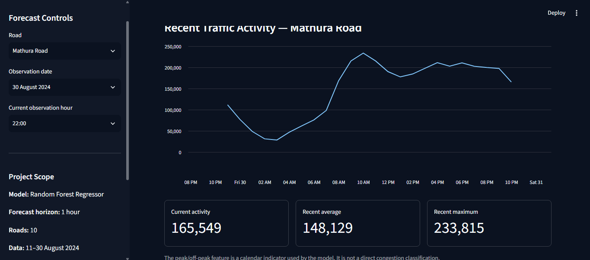
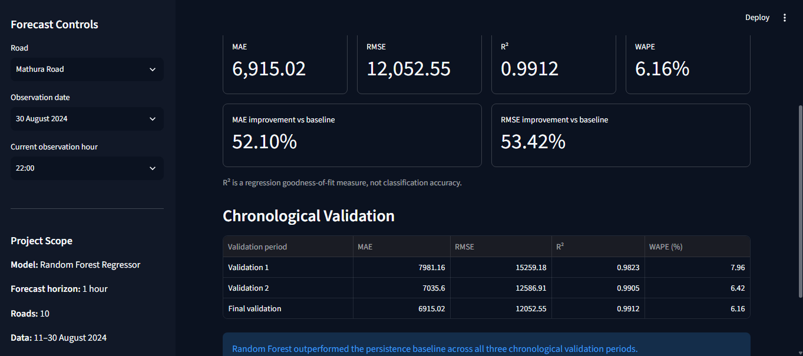
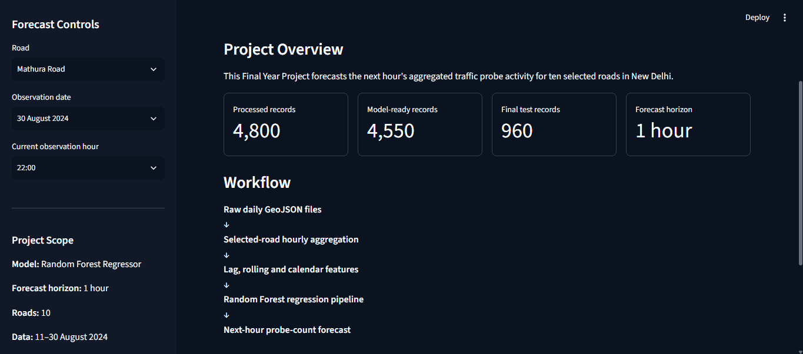

# New Delhi Next-Hour Traffic Probe Count Forecasting

Machine-learning based one-hour-ahead forecasting of aggregated traffic probe activity for ten selected roads in New Delhi.

**BSc (Hons) Computer Science Final Year Project**



## Project Overview

This project develops an end-to-end machine-learning workflow for forecasting the next hour's aggregated traffic probe count for selected roads in New Delhi.

The source data consists of 20 daily GeoJSON files covering **11-30 August 2024**. Raw segment-level observations are transformed into road-date-hour records for ten selected named roads. Temporal, lagged, rolling, calendar and road-level features are then used for one-hour-ahead forecasting.

Three forecasting approaches were evaluated chronologically:

- Current-hour persistence baseline
- Random Forest Regressor
- Gradient Boosting Regressor

The **Random Forest Regressor** produced the strongest final holdout performance and was integrated into a Streamlit historical-evaluation application.

## Key Results

| Metric | Random Forest |
|---|---:|
| MAE | 6,915.02 |
| RMSE | 12,052.55 |
| R² | 0.9912 |
| WAPE | 6.16% |
| MAE improvement vs baseline | 52.10% |
| RMSE improvement vs baseline | 53.42% |

The model was evaluated on a chronological holdout containing **960 later observations from all ten selected roads**.

Random Forest also outperformed the persistence baseline across all three expanding-window chronological validation periods.

> **Important:** R² is a regression goodness-of-fit measure and is not classification accuracy.

## Forecasting Target

The model predicts:

**Next-hour aggregated road-level probe activity**

The project does **not** claim to predict:

- exact unique vehicle counts,
- an official congestion percentage, or
- a congestion class.

The original source contains probe-count observations for individual road segments. Probe counts from matching segments belonging to the same named road are aggregated into a road-level hourly value.

Therefore, `probe_count` in this project should be interpreted as **aggregated segment-level probe activity**.

## Dataset

**Source:** New Delhi Traffic Probe & Analytics 2024  
**Curators:** Ryan Madhuwala and Parv Mittal  
**Platform:** Kaggle

https://www.kaggle.com/datasets/rawsi18/new-delhi-traffic-probe-and-analytics-2024

### Project Scope

| Characteristic | Value |
|---|---:|
| Raw daily files | 20 |
| Observation period | 11-30 August 2024 |
| Selected roads | 10 |
| Processed records | 4,800 |
| Processed variables | 12 |
| Model-ready records | 4,550 |
| Final holdout records | 960 |
| Forecast horizon | 1 hour |

The raw GeoJSON archive is not included in this repository.

## Selected Roads

The forecasting workflow was implemented for:

1. Mahatma Gandhi Marg
2. Mathura Road
3. Outer Ring Road
4. Aurobindo Marg
5. Mehrauli Badarpur Road
6. Barapullah Road
7. Vikas Marg
8. Africa Avenue
9. Sardar Patel Marg
10. Noida Link Road

The ten-road selection represents the defined project scope and should not be interpreted as the complete New Delhi road network.

## Machine-Learning Workflow

```text
Raw daily GeoJSON files
        |
        v
Raw-data verification
        |
        v
Selected-road extraction
        |
        v
Road-date-hour aggregation
        |
        v
4,800-row processed dataset
        |
        v
Lag, rolling and calendar features
        |
        v
4,550 model-ready observations
        |
        v
Chronological train / holdout split
        |
        v
Baseline + Random Forest + Gradient Boosting
        |
        v
Model comparison and validation
        |
        v
Saved Random Forest Pipeline
        |
        v
Streamlit historical-evaluation application
```

## Feature Engineering

The final model uses 14 input features:

- `street_name`
- `probe_count`
- `lag_1`
- `lag_24`
- `rolling_mean_3`
- `rolling_mean_24`
- `target_hour`
- `target_day_number`
- `target_is_weekend`
- `target_is_peak_hour`
- `segment_count`
- `average_speed_limit`
- `average_frc`
- `total_distance`

The forecasting target, `target_next_hour`, represents the recorded probe count for the same road one hour later.

Chronological ordering was preserved throughout model evaluation.

## Model Comparison

| Model | MAE | RMSE | R² | MAE Improvement | RMSE Improvement |
|---|---:|---:|---:|---:|---:|
| Persistence Baseline | 14,436.72 | 25,877.12 | 0.9593 | - | - |
| Random Forest | **6,915.02** | **12,052.55** | **0.9912** | **52.10%** | **53.42%** |
| Gradient Boosting | 8,093.84 | 15,162.50 | 0.9860 | 43.94% | 41.41% |

Random Forest was selected as the final model because it produced the lowest MAE and RMSE on the chronological holdout.

## Streamlit Application

The trained Random Forest preprocessing-and-model Pipeline is integrated into a local Streamlit application.

The user can select:

- road,
- historical observation date, and
- current observation hour.

The application reconstructs the required model features automatically and generates a next-hour forecast.

It also provides:

- recorded next-hour comparison,
- absolute and percentage error,
- recent traffic pattern,
- model-performance metrics,
- chronological-validation results, and
- project workflow information.

### Prediction Example


For **Mathura Road, 30 August 2024 at 22:00**:

| Result | Value |
|---|---:|
| Current probe count | 165,549 |
| Predicted next hour | 136,529 |
| Recorded next hour | 137,616 |
| Absolute error | 1,087 |
| Percentage error | 0.79% |

### Recent Traffic Activity



### Model Performance



### Project Overview Interface



The Streamlit application is a **historical-evaluation prototype**. It is not connected to a live traffic feed.

## Repository Structure

```text
FYP_NewDelhi_Traffic/
|
|-- app/
|   |-- .streamlit/
|   |   `-- config.toml
|   |-- app.py
|   |-- random_forest_next_hour_traffic_model.joblib
|   |-- requirements.txt
|   `-- selected_delhi_roads_hourly.csv
|
|-- docs/
|   `-- screenshots/
|
|-- notebooks/
|   |-- 02_Next_Hour_Traffic_Forecasting_Colab.ipynb
|   |-- 03_Exploratory_Data_Analysis.ipynb
|   |-- 04_Model_Validation.ipynb
|   |-- 05_Model_Interpretation_and_Robustness.ipynb
|   `-- 06_Prototype_Readiness_Test.ipynb
|
|-- outputs/
|   |-- feature_importance_detailed.csv
|   |-- feature_importance_results.csv
|   |-- model_comparison_results.csv
|   |-- prototype_readiness_test_result.csv
|   |-- prototype_ten_road_test_results.csv
|   |-- random_forest_per_road_metrics.csv
|   |-- random_forest_test_predictions.csv
|   |-- rolling_validation_results.csv
|   `-- selected_roads_dataset_summary.txt
|
|-- src/
|   |-- 00_Abstract_Evidence_Check.py
|   `-- 01_Create_Selected_Roads_Dataset.py
|
|-- .gitignore
`-- README.md
```

## Main Notebooks

**02_Next_Hour_Traffic_Forecasting_Colab.ipynb**  
Feature engineering, chronological split, baseline comparison, Random Forest, Gradient Boosting and final model export.

**03_Exploratory_Data_Analysis.ipynb**  
Data-quality verification and exploratory traffic analysis.

**04_Model_Validation.ipynb**  
Residual analysis, hourly error analysis and road-level model validation.

**05_Model_Interpretation_and_Robustness.ipynb**  
Grouped Random Forest feature importance and expanding-window chronological validation.

**06_Prototype_Readiness_Test.ipynb**  
Final application-readiness checks and ten-road functional testing.

## Running the Streamlit Application

Move into the application directory:

```bash
cd app
```

Install the pinned dependencies:

```bash
python -m pip install -r requirements.txt
```

Launch Streamlit:

```bash
python -m streamlit run app.py
```

Then open the local Streamlit URL displayed in the terminal, normally:

```text
http://localhost:8501
```

### Required Versions

The final application uses pinned package versions including:

```text
streamlit==1.60.0
pandas==2.2.2
numpy==2.0.2
scikit-learn==1.6.1
joblib==1.5.3
```

Using the pinned scikit-learn version is recommended when loading the saved Joblib model.

## Limitations

The available dataset covers only 20 consecutive days and ten selected roads.

The project therefore evaluates short-term forecasting behaviour within the available historical sample and should not be interpreted as:

- a city-wide New Delhi traffic model,
- a seasonal or long-term forecasting system,
- a live traffic service,
- an exact vehicle-counting system, or
- a direct congestion-classification model.

Weather, incidents, road works, public events and explicit spatial relationships between connected roads were not included as model inputs.

## Future Work

Future extensions could include:

- longer multi-month or multi-year datasets,
- live or periodically updated traffic data,
- verified speed or congestion targets,
- weather and incident information,
- spatial relationships between connected road segments,
- additional forecasting horizons, and
- comparison with sequence or graph-based deep-learning approaches.

## Project Status

**Completed.**

The implementation, model evaluation, Streamlit application and project documentation have been completed, and the project has been confirmed ready for endorsement.

## Author

**Suyambu Raj Kanagaraj**  
BSc (Hons) Computer Science  
Final Year Project
